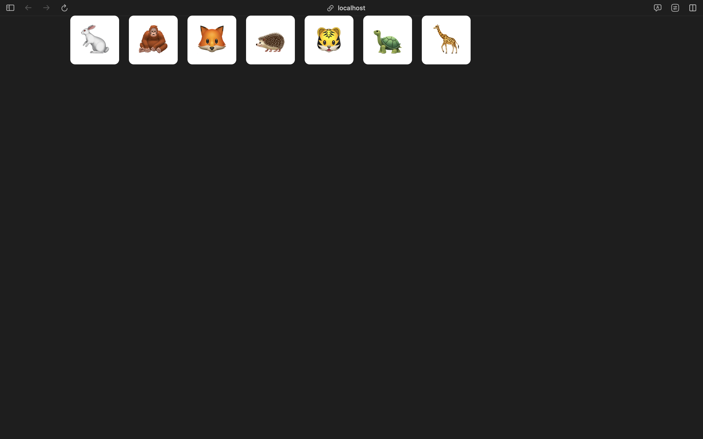
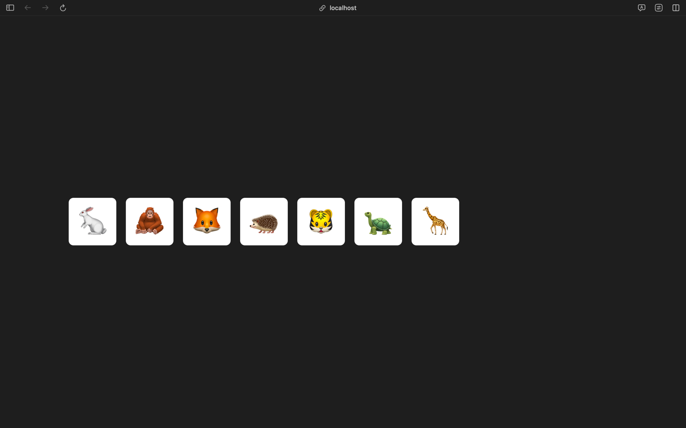

# Задача

Перед вами интерфейс, который используют в зоопарке. Нажимая кнопку, администратор напоминает сотруднику о том, что нужно покормить определённое животное. Шаг за шагом сделаем интерфейс удобнее.

Сейчас задача — разместить все кнопки по центру поперечной оси флекс-контейнера и переносить кнопки на следующую строку, когда они не влезают.

### Текущий результат

### Ожидаемый результат

               

###### подсказки
Вам помогут свойства `align-items` и `flex-wrap`.