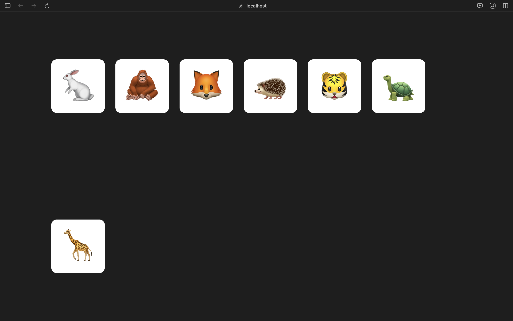

# Задача

При узком экране перенос текста будет выглядеть следующим образом:

#### Текущий результат

   

Примените свойство `align-content`, чтобы при переносе на новую строку кнопки оставались по центру.

#### Ожидаемый результат

               

###### подсказки

Укажите значение `center`.