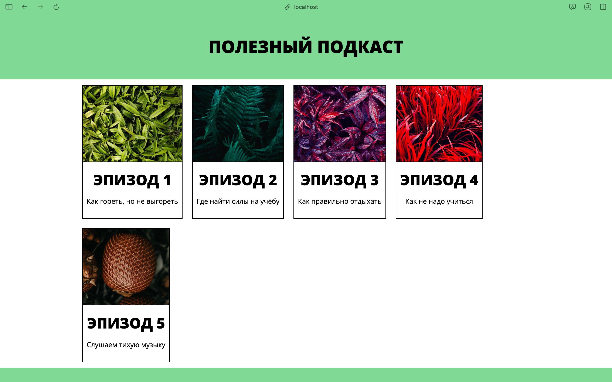
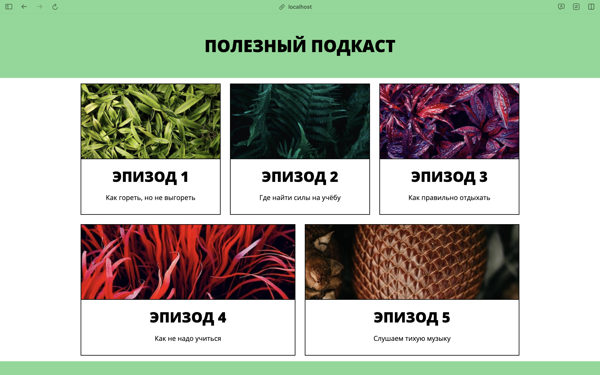

# Задача

Решить эту задачу поможет свойство `flex-basis`. Оно указывает размер элемента до того, как на него начнёт действовать
расширение.

Значением `flex-basis` может быть размер в любых относительных или абсолютных единицах. Значение по умолчанию — `auto`. В
таком случае элемент занимает столько пространства, сколько требуется для отображения его контента.

Добавьте элементу `.card` базовый размер `300px`. Затем разрешите карточкам занимать свободное пространство, если оно есть.

#### Текущий вид

#### Ожидаемый результат
